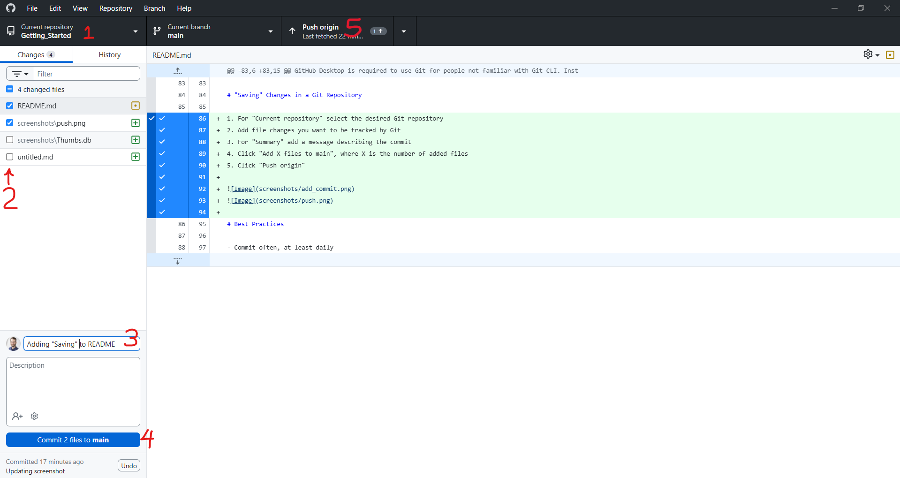

# What is Git?

**Git** is a version-control tool that keeps track of changes to files. It lets you record versions of your work in **Git repositories** and go back if something breaks. **GitHub** is a website that stores and shares Git repositories online.

# Setting Up Git

Follow the steps outlined in the following sections:

- GitHub Accounts -> Personal Account
- GitHub Desktop

# GitHub Accounts

### GitHub Organization

The Bluewater Health GitHub organization is used to store and manage Bluewater Health's Git repositories. Included members, permissions, and other important settings can only be controlled by owners.

**Link:** https://github.com/BluewaterHealth

### Personal Account

Everyone using Git needs their own GitHub account using their work email for traceability. Personal accounts should only be used to access and make changes to Git repositories under by Bluewater Health. Personal accounts should not have Git repositories themselves. Sign up for a free GitHub account using the link below. Once created, send an owner your username so you can be given appropriate roles and permissions.

**Link:** https://github.com/signup

### Upgrading GitHub

If Bluewater Health ever wants finer control over roles and permissions, among other things, we can upgrade to GitHub Team ($4 per user/month) or GitHub Enterprise ($21 per user/month). More info is available via the link below.

**Link:** https://github.com/pricing

# GitHub Desktop

GitHub Desktop is required to use Git for people not familiar with Git CLI. Installation and usage of GitHub Desktop is outlined in the links below.

**Installation:** https://github.com/apps/desktop

**Video Tutorial:** https://www.youtube.com/watch?v=AYJQi6TyPyU

# Roles and Permissions

Permissions control what organization members can do with Git. Roles are a collection of permissions that can be assigned to individual team members, or an entire team. Below is a summary of the primary Git roles:

- **Read:** For viewing Git repositories 
    - Can pull files locally, but not push
- **Write:** For contributing to a Git repository
    - Can do everything "Read" can do plus push changes
- **Admin:** For full control of a Git repository
    - Can do everything "Write" can do plus administrator actions for that repository
- **Owner:** For full control of an organization
    - Can do everything "Admin" can do for all Git repositories under an organization plus administrator actions for that organization

# Creating a Git Repository

1. Log in to GitHub
2. Navigate to existing repositories: https://github.com/orgs/BluewaterHealth/repositories
3. Create a new repository:
    1. Click "New repository"
    2. Populate "Repository name"
    3. Populate "Description"
    4. For "Choose visibility" select "Private" **<- IMPORTANT!!!**
    5. For "Add README" select "On"
    6. For "Add .gitignore" select "No .gitignore"
    7. For "Add license" select "No license"
    8. Click "Create repository"
4. Give access to collaborators, if applicable:
    1. Click "Settings"
    2. Click "Collaborators and teams"
    3. Click "Add people" or "Add teams" to add a person or team respectively, add the appropriate role
    5. Each added account must accept an email invitation

# Cloning a Git Repository

1. Open GitHub Desktop
2. Click "File"
3. Click "Clone Repository..."
4. Select the Git repository to clone, you have read permissions for it to display
5. Choose a path to save the repository to, shared drives are supported
6. Click "Clone"

# "Saving" Changes in a Git Repository

1. For "Current repository" select the desired Git repository
2. Add the file changes you want to be tracked by Git
3. For "Summary" add a message describing the commit
4. Click "Add X files to main", where X is the number of added files
5. Click "Push origin"

# Best Practices

- Commit often
- Have a README file with documentation
- Do not make changes directly on the GitHub website
- Do not give someone more permissions than they need
- Avoid changing files at the same time as someone else until a branching strategy is outlined

# Large-File Storage

GitHub limits the size of files to 100 MB by default. To track files up to 2 GB, you can use Git Large File Storage, outlined in the link below.

**Link:** https://docs.github.com/en/repositories/working-with-files/managing-large-files/about-git-large-file-storage