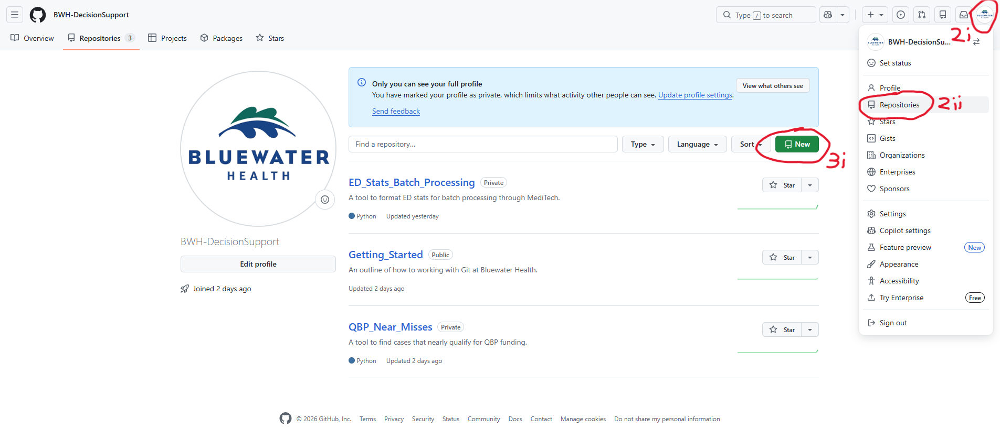
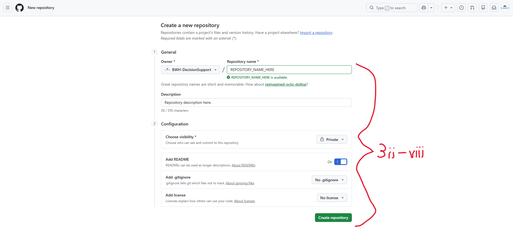
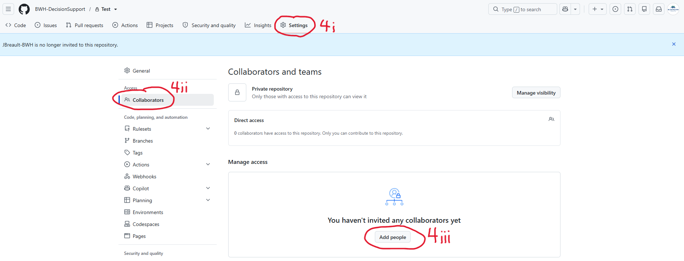
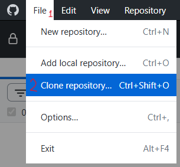
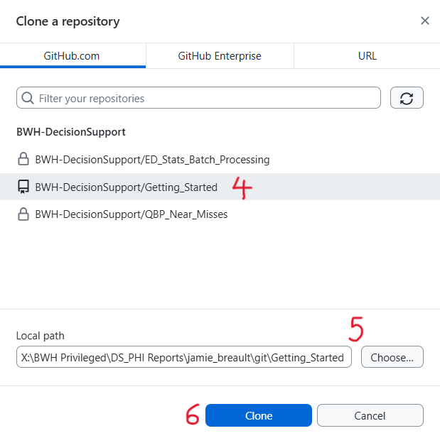

# What is Git?

**Git** is a version-control tool that keeps track of changes to files. It lets you record versions of your work in **Git repositories** and go back if something breaks. **GitHub** is a website that stores and shares Git repositories online.

# Setting Up Git

Follow the steps outlined in the following sections:

- Installing Git
- GitHub Accounts -> Personal Account
- GitHub Desktop

# Installing Git

Download the latest version of **Git for Windows** from the link below and follow the installation instructions. When installing, default parameters can be used, however, when choosing the default editor used by Git you may want to change the selection from Vim to a text editor you are familiar with.
 
**Link:** https://git-scm.com/install/windows

# GitHub Accounts

### Personal Account

Everyone on the team using Git needs their own GitHub account using their work email for trackability. Personal accounts should only be used to access and make changes to team Git repositories. Personal accounts should not have Git repositories themselves. Sign up for a free GitHub account using the link below.

**Link:** https://github.com/signup

### Team Account

**Username:** BWH-DecisionSupport
**Password:** Ask Decision Support manager

This is a GitHub account for the Bluewater Health Decision Support Team, created using the team email (DecisionSupportTeam@bluewaterhealth.ca). This account should only be used to store team Git repositories. File changes should only be done under personal accounts, not the team account.

### Upgrading GitHub

If the team ever wants to do code reviews with code owners (required reviewers), we can upgrade to GitHub Team ($4 per user/month) or GitHub Enterprise ($21 per user/month). More info is available via the link below.

**Link:** https://github.com/pricing

# GitHub Desktop

GitHub Desktop is required to use Git for people not familiar with Git CLI. Installation and usage of GitHub Desktop is outlined in the links below. Be sure to sign in using your personal GitHub account, not the team account.

**Installation:** https://github.com/apps/desktop
**Video Tutorial:** https://www.youtube.com/watch?v=AYJQi6TyPyU

# Creating a Git Repository

1. Login to GitHub using the team account
2. Navigate to existing repositories:
    1. Click the small Bluewater Health logo in the upper right corner
    2. Click "Repositories"
3. Create a new repository:
    1. Click "New"
    2. Populate "Repository name"
    3. Populate "Description"
    4. For "Choose visibility" select "Private" **<- IMPORTANT!!!**
    5. For "Add README" select "On"
    6. For "Add .gitignore" select "No .gitignore"
    7. For "Add license" select "No license"
    8. Click "Create repository"
4. Give access to personal accounts:
    1. Click "Settings"
    2. Click "Collaborators" and provide the team account password
    3. Click "Add People", search for and add a personal account, repeat for all accounts that need access
    4. For each added account, there is an email invitation that must be accepted while logged into GitHub with the personal account

# Cloning a Git Repository

1. Open GitHub Desktop
2. Click "File"
3. Click "Clone Repository..."
4. Select the Git repository to clone, your personal GitHub account must be included as a collaborator on the repository for it to appear (refer to Creating a Git Repository, Step 4)
5. Choose a path to save repository to, shared drives are supported
6. Click "Clone"

# "Saving" Changes in a Git Repository

# Best Practices

- Commit often, at least daily
- Do not make changes on GitHub directly
- Have a README file with documentation

# Large-File Storage

GitHub limits the size of files allowed in repositories to 100 MB by default. To track files up to 2 GB, you can use Git Large File Storage, outlined in the link below.

**Link:** https://docs.github.com/en/repositories/working-with-files/managing-large-files/about-git-large-file-storage